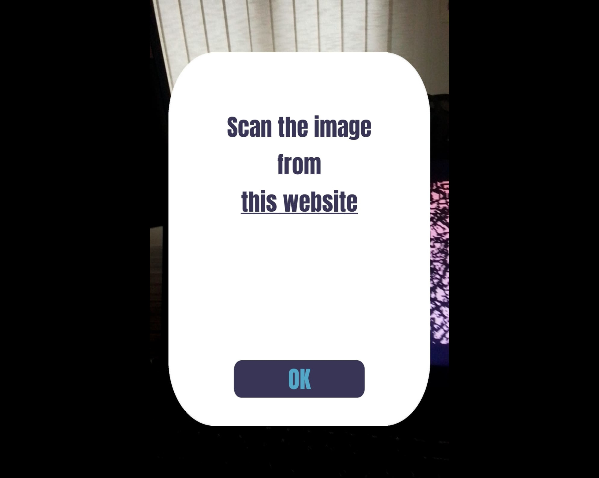

An augmented reality mobile app, where the user can place 3D models in the real world. It also has two AR games.
The user can select a 3D model that can be placed in the real world. It can be placed either on the ground or in the air.

###### **Reaction**
An augmented reality mobile game that requires the player to identify an image. Upon detection, buttons appear on this image. The player must place their finger on the green button, which is then located by the camera.

King Survival: An augmented reality game for Android, developed using Unity and C#, where the player has to place a King in the real world and he has to shoot the enemies with a laser.

